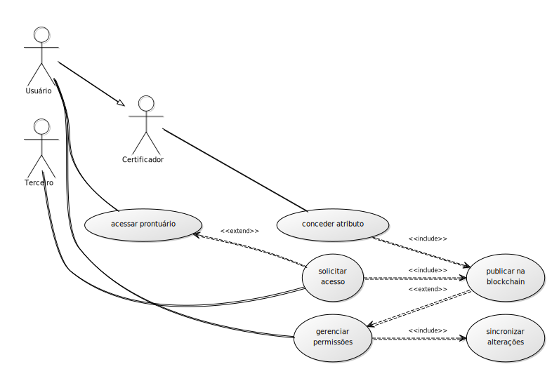

# Arquitetura do Protótipo do PGC

## codinome: hyper-abe

Sumário

<details><summary> clique para expandir </summary>

1. [Componentes](#componentes)
2. [Atores](#atores)
3. [Diagramas](#diagramas)
4. [Estruturas de Dados](#estruturas-de-dados)
5. [Principais funções](#funções)
6. [Estória de uso](#estórias-de-uso)

</details>

## Componentes

Haverão 3 componentes que vão interagir nesse sistema:

1. **Cliente**: interface do sistema aos usuários, irá realizar operações de descriptografia, requisição de dados e sincronização com o(s) servidor(es) de dados.

2. **Servidor**: base de dados acessível online, conterá a coleção de arquivos relativos ao prontuário de um usuário, compactados e criptografados com um esquema de criptografia baseada em atributos (CBA).

        Obs: a descrição do protótipo está evidenciando a necessidade de desmembrar esse componente em servidores de dados de prontuário e servidores dedicados à infraestrutura do sistema.

3. **Blockchain**: rede blockchain privada baseada em Hyperledger, que registrará as transações de requisição de acesso e de publicação de prontuários. É pressuposto que os dados publicados serão gerenciados por um Smart Contract, caso exista esta necessidade.

## Atores

Os possíveis usuários foram abstraídos em 6 categorias distintas:

1. **Médico**: representa a equipe médica, e aqueles que precisam ter acesso ao prontuário para prestar atendimento médico.

2. **Administrativo**: o corpo administrativo do Hospital. Podem haver diferenciações internas quanto às permissões de leitura e escrita no prontuário. O diagrama aponta para o cargo com a efetiva permissão de publicar prontuários no sistema.

3. **Funcionário**: todo o corpo de funcionários do Hospital. É uma superclasse dos atores Médico e Administrativo.

4. **Paciente**: o dono do prontuário.

5. **Terceiro**: alguém autorizado a acessar o prontuário do paciente, seja pelo paciente, seja pelo hospital.

6. **Certificador**: um usuário com a capacidade de emitir atributos a outros usuários.

## Estruturas de dados

As estruturas de dados identificadas como necessárias para a execução do protótipo são:

### Transações

#### Requisição de atributo

Um objeto JSON com os campos:

```json
{
    "registerTransaction":"hash da transação de registro no sistema pelo requerente",
    "atributes":[
        "atributo 1",
        "(...)",
        "atributo N"
    ],
    "signature":"Assinatura da mensagem enviada diretamente à autoridade com a solicitação",
    "authorities":[
        "Autoridade 1",
        "(...)",
        "Autoridade M"
    ]
}
```

#### concessão de atributo

Um objeto JSON com os campos:

```json
{
    "requesterAddress":"endereço do requerente",
    "result":[
        "código informando concessão ou não do atributo 1",
        "(...)",
        "código informando concessão ou não do atributo N"
        ],
    "signature":"Assinatura da mensagem enviada diretamente ao requerente, caso exista",
}
```

Obs: o campo result usará uma tabela de código informando a concessão de um atributo, e uma série de códigos informando o motivo de negar tal atributo, caso ocorra. Para fins de construção de protótipo, usaremos apenas 2 códigos: ```ACCEPTED_REQUEST``` e ```DENIED_REQUEST```

#### publicação de prontuário

Um objeto JSON com os campos:

```json
{
    "ownerAddress":"Endereço do Dono do Prontuário",
    "EHRSources":[
        {
            "sourceName": "Nome da instituição dona do Servidor",
            "ciphertextParams": {
                "accessStructure": "regra de acesso para descriptografia",
                "c0": "parâmetro c0",
                "c1": ["parâmetros c1"],
                "c2": ["parâmetros c2"],
                "c3": ["parâmetros c3"],
            },
            "source": "dados criptografados"
        }
    ]
}
```

Quando descriptografado, ```source``` conterá a seguinte informação:

```json
{
    "sourceName":"...",
    "ciphertextParams": {...},
    "source":
    {
        "IP":"IP do servidor do prontuário",
        "key":"chave para referenciar o prontuário em questão ao Servidor"
    }
}
```

#### publicação dos Parâmetros Globais

Um objeto JSON com os campos:

```json
{
    "type": "",
    "p": "",
    "n": "",
    "n0": "",
    "n1": "",
    "n2": "",
    "l": "",
    "append": ["(...)"]
}
```

#### publicação de autoridade

A ser feito

### Arquivos

- EHR (prontuário)
- teste (contém hash)
- gerados pelo DCPABE

### Smart Contract

```java
class Container {
    Paciente patients[];

    public addPatient(Address patient);
    public getPatient(Address patient);
}
```

```java
class Paciente {
    Prontuário prontuários[];
    String nome;
    String email;

    addEHR();
    getEHR();
}
```

```java
class Prontuário {
    String url;
    String código;
}
```

### Servidor

- arquivo temp com chave privada do atributo enquanto o cliente não recebe

## Diagramas

Os atores e funcionalidades do sistema estão resumidos nos seguintes diagramas de caso de uso:

1. **Diagrama de consulta e edição de dados**


2. **Diagrama de gerenciamento de regras de acesso**


## Funções

1. **acessar prontuário**: usando termos de pesquisa, o *cliente* acessa a *blockchain* em busca da transação que os contenha. A transação contém um objeto cifrado por atributos. O objeto contém o(s) endereço(s) do(s) *servidor(es)*, e as senhas para descriptografar cada arquivo. Ao requisitar dados do(s) *servidores*, o *cliente* recebe como resposta um teste - um objeto criptografado com o mesma senha usada no prontuário, contendo o hash do arquivo do prontuário. Se o hash informado pelo cliente for o hash do prontuário, o *servidor* o envia ao *cliente*.

2. **alterar prontuário**: necessitando adicionar um arquivo ao prontuário ou editar um campo dele, um usuário acessa um prontuário. Ele realiza as alterações, que podem ser de dois tipos: em permissões ou em documentos. No caso de documentos, as alterações são sincronizadas com o *servidor*. No caso de permissões, segue-se o esquema descrito na em (3). Qualquer alteração passível de alterar os dados do arquivo de teste exigirá a produção de um novo arquivo, para ser enviado ao *servidor* juntamente com o prontuário alterado.

3. **gerenciar permissões**: Um usuário pode alterar a permissão de qualquer parte do prontuário, se tiver a credencial para isso. Se for uma alteração em uma sub-árvore da estrutura do prontuário, o documento é alterado pelo *cliente* e ele é sincronizado com o(s) *servidor(es)*. Caso a alteração da permissão seja na raíz da árvore do prontuário, isto é, criptografando o próprio acesso ao prontuário, o *cliente* publica a nova permissão na *blockchain* e sincroniza os dados com o *servidor*.

4. **criar chaves de acesso**: Um paciente utiliza o *cliente* para obter uma carteira válida na *blockchain*. A chave privada é criptografada sob uma senha escolhida à critério do cliente.

5. **publicar prontuário**: Um funcionário de uma instituição de saúde com permissões administrativas ou um paciente podem publicar um prontuário. Caso o publicante não seja o paciente, é necessário que aquele informe a chave pública dele e também a chave pública do atributo "autorizado", gerado por ele. O *cliente* pesquisa na *blockchain* se existe um prontuário com os dados informados pelo paciente e a operação é abortada neste caso. Caso o prontuário não esteja em nenhum servidor, o cliente envia um arquivo de prontuário vazio, somente com dados pessoais, para algum *servidor* destinado a este fim. A *regra de acesso básica* para um prontuário é "autorizado OU CRM OU CFM". O *cliente* publica um objeto na *blockchain*, contendo o(s) endereço(s) dos arquivos no(s) *servidor(es)*, cifrados com a *regra de acesso básica*, e campos de identificação para consulta, como chave pública, nome e e-mail. Após a publicação, o *cliente* gera um arquivo de teste necessário para o acesso ao ao arquivo do prontuário, e o envia ao(s) *servidor(es)* envolvidos.

6. **solicitar acesso**: Um usuário pode solicitar acesso a um prontuário. Após verificar a ausência de credenciais para acessar um prontuário, o *cliente* consulta na *blockchain* quais são as entidades certificadores que podem emitir os atributos faltantes. Caso não encontre alguma, pode haver alguma inconsistência na regra de acesso, então supõem-se que uma autoridade sempre será encontrada, ou então o dono do prontuário é obrigado a alterar a regra de acesso removendo o atributo em questão. O *cliente* publica na blockchain uma solicitação para obtenção de tais atributos.

7. **conceder atributo**: O *cliente* de algum certificador descobre a requisição publicada na *blockchain* e caso ache ela legítima gera um par de chaves do atributo em questão a partir do endereço público do requerente. Ele criptografa a mensagem usando o endereço público, de forma que somente o *cliente* do requerente possa recuperar as chaves. Esse envio é p2p, ou por meio de um *servidor* dedicado para a comunicação entre usuários do sistema, sem utilizar os servidores dos arquivos de prontuários ou a *blockchain*. Para fins de auditoria, o certificador publica na *blockchain* uma transação informando a concessão ou não do atributo, juntamente com um código informando o motivo de recursa.

## Estórias de Uso

As estórias de uso descritas aqui servirão para basear futuros testes funcionais do protótipo.

### UC #01 - busca e alteração de dados no sistema

<details><summary> clique para ler este caso </summary>

O Médico Dr. Marcus vai receber um novo paciente, o Pedro. Ele acessa seu cliente através  de um browser.

O sistema mostra uma tela de login. Marcus já tem cadastro. Ele cede ao cliente um arquivo contendo chave pública e privada válida para a blockchain.

O sistema solicita uma senha para desbloqueio da chave privada.

Ele entra no sistema e informa a chave pública do usuário para realizar a busca pelo prontuário do paciente na blockchain.

A última transação associada ao paciente é encontrada. O cliente informa isso na tela mostrando a data, o nome do paciente e a política de acesso para aquele prontuário.

Os atributos necessários para descriptografar as informações do prontuário é "autorizado OU hospital-A OU CRM OU CFM". O médico possui o atributo hospital-A. O cliente baixa a cifra da blockchain, decifra o objeto inserido na transação que publicou o prontuário e obtém assim o endereços do arquivo no servidor e a senha para ele.

O arquivo é recuperado do servidor, onde é decifrado com a senha pega na blockchain.

Esse arquivo contém um EMR criptografado de forma modular. Informações básicas e nós sem informações sensíveis estão públicas. Há um nó criptografado com a política "oncologista". Dr. Marcus tem o atributo "oncologista" concedido pelo CFM, então ele consegue visualizar que o nó existe, e o descriptografa.

Lendo a informação ali e outras, ele finalmente chama o paciente para atendimento.

Ao fim do atendimento, ele edita o arquivo, e encaminha a atualização para o servidor.

O sistema associa aquele paciente como paciente associado ao Dr. Marcus para agilizar futuras pesquisas.

</details>

### UC #02 - inclusão de prontuário no sistema

<details><summary> clique para ler este caso </summary>

O Hospital A vai aderir ao Hyper-dcpabe. Ele entra na tela de criação de prontuários.

o hospital possui um arquivo com uma estrutura em árvore com os dados do paciente chamado EMR. É necessário informar na hora a chave pública do cliente, caso ela não esteja presente no arquivo do prontuário. O cliente solicita um arquivo assim.

A partir do arquivo, é realizado uma criptografia recursiva, a partir das folhas, sobre os campos que deve deveriam ser criptografados. O progresso é mostrado na tela.

É gerado um arquivo, que criptografado com uma cifra "Autorizado OU Hospital-A OU CRM OU CFM". O arquivo é enviado ao servidor, que por sua vez remete um endereço de volta ao cliente.

Com o endereço, aparece um botão para publicar o prontuário na blockchain. É preparada uma mensagem contendo o endereço público do paciente, nome, e-mail e uma cifra ABE do(s) endereço(s) do arquivo, com a mesma cifra "Autorizado OU Hospital-A OU CRM ou CFM".

</details>

### UC #03 - solicitação de acesso a prontuário

<details><summary> clique para ler este caso </summary>

Edna, esposa de Pedro, precisa acessar o prontuário dele para acompanhar a situação.

Ela acessa o cliente do hyper-abe, fornece o arquivo com a chave privada e fornece a senha para o acesso. Ela entra no sistema.

Ele aciona a consulta pelo prontuário de Pedro e o encontra.

Ela tenta acessar e suas credenciais falham.

O sistema informa que ela pode solicitar acesso como "autorizado" ao prontuário.

O familiar solicita e é orientado a aguardar notificação de autorização. A solicitação é publicada na blockchain.

O cliente de Pedro também possui um perfil certificador, gerado para o próprio cliente, capaz de conceder o atributo "autorizado". O cliente de Pedro lê a requisição na blockchain, e notifica se Pedro deseja conceder o atributo "autorizado" ao usuário de Edna.

Pedro confirma a operação. O cliente manda um arquivo contendo a chave privada do atributo gerado para edna, criptografado no endereço público de edna. O arquivo é subido no servidor, no mesmo diretório relacionado ao prontuário do Pedro. É publicada uma transação informando que o atributo autorizado foi concedido à edna.

Edna é notificada sobre a alteração de sua credencial, e atualiza a página.

O cliente procura em um registro de falhas de acesso, a partir do mais recente para o mais antigo, se algum passa a funcionar. Ele encontra o prontuário de Pedro. Ele informa que o Prontuário de Pedro está disponível para acesso, e pergunta se ela quer checar todas as tentativas, se quer acessar ou se não quer fazer nada.

Edna confirma que quer acessar, e então pode visualizar o prontuário.

</details>
