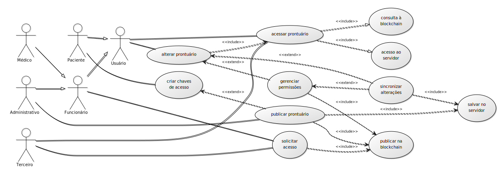

# Protótipo do PGC

## codinome: hyper-abe

## Arquitetura

### Componentes

Haverão 3 componentes que vão interagir nesse sistema:

1. **Cliente**: interface do sistema aos usuários, irá realizar operações de descriptografia, requisição de dados e sincronização com o(s) servidor(es) de dados.

2. **Servidor**: base de dados acessível online, conterá a coleção de arquivos relativos ao prontuário de um usuário, compactados e criptografados com um esquema de criptografia baseada em atributos (CBA).

3. **Blockchain**: rede privada baseada em Hyperledger, que registrará as transações de requisição de acesso e de publicação de prontuários.

### Atores

Os possíveis usuários foram abstraídos em 5 categorias distintas:

1. **Médico**: representa a equipe médica, e aqueles que precisam ter acesso ao prontuário para prestar atendimento médico.

2. **Administrativo**: o corpo administrativo do Hospital. Podem haver diferenciações internas quanto às permissões de leitura e escrita no prontuário. O diagrama aponta para o cargo com a efetiva permissão de publicar prontuários no sistema.

3. **Funcionário**: todo o corpo de funcionários do Hospital. É uma superclasse dos atores Médico e Administrativo.

4. **Paciente**: o dono do prontuário.

5. **Terceiro**: alguém autorizado a acessar o prontuário do paciente, seja pelo paciente, seja pelo hospital.

### Caso de Uso preliminar

Os atores e funcionalidades do sistema estão resumidos no seguinte diagrama

1. Diagrama de consulta e edição de dados

### Funcionalidades

1. **acessar prontuário**: usando termos de pesquisa, o *cliente* acessa a *blockchain* em busca da transação que publicou aquele prontuário. Após validar a permissão de acesso, ele obtém o endereço do *servidor*, ou uma série de endereços, caso o prontuário esteja distribuído, e a chave que criptografou o arquivo. O *cliente* recebe um teste criptografado com o mesmo código do arquivo em tempo de seu envio e se passar, o *servidor* o envia ao *cliente*.

2. **alterar prontuário**: necessitando adicionar um arquivo ao prontuário ou editar um campo dele, um usuário acessa um prontuário. Ele realiza as alterações, que podem ser de dois tipos: em permissões ou em documentos. No caso de documentos, as alterações são sincronizadas com o *servidor*. No caso de permissões, segue-se o esquema descrito na em (3).

3. **gerenciar permissões**: Um usuário pode alterar a permissão de qualquer parte do prontuário, se tiver a credencial para isso. Se for uma alteração em uma sub-árvore da estrutura do prontuário, o documento é alterado pelo *cliente* e ele é sincronizado com o(s) *servidor(es)*. Caso a alteração seja na raíz da árvore do prontuário, isto é, no próprio prontuário, o *cliente* publica a nova permissão e sincroniza os dados com o *servidor*.

4. **criar chaves de acesso**: O paciente utiliza o cliente para obter uma carteira válida na blockchain.

5. **publicar prontuário**:

6. **solicitar acesso**:

7. **criar chaves de acesso**:
