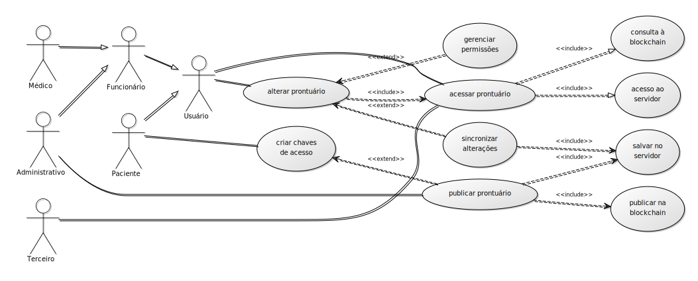

# Protótipo do PGC

## codinome: hyper-abe

## Arquitetura

### Componentes

Haverão 3 componentes que vão interagir nesse sistema:

1. **Cliente**: interface do sistema aos usuários, irá realizar operações de descriptografia, requisição de dados e sincronização com o(s) servidor(es) de dados.

2. **Servidor**: base de dados acessível online, conterá a coleção de arquivos relativos ao prontuário de um usuário, compactados e criptografados com um esquema de criptografia baseada em atributos (CBA).

        Obs: a descrição do protótipo está evidenciando a necessidade de desmembrar esse componente em servidores de dados de prontuário e servidores dedicados à infraestrutura do sistema.

3. **Blockchain**: rede blockchain privada baseada em Hyperledger, que registrará as transações de requisição de acesso e de publicação de prontuários. É pressuposto que os dados publicados serão gerenciados por um Smart Contract, caso exista esta necessidade.

### Atores

Os possíveis usuários foram abstraídos em 6 categorias distintas:

1. **Médico**: representa a equipe médica, e aqueles que precisam ter acesso ao prontuário para prestar atendimento médico.

2. **Administrativo**: o corpo administrativo do Hospital. Podem haver diferenciações internas quanto às permissões de leitura e escrita no prontuário. O diagrama aponta para o cargo com a efetiva permissão de publicar prontuários no sistema.

3. **Funcionário**: todo o corpo de funcionários do Hospital. É uma superclasse dos atores Médico e Administrativo.

4. **Paciente**: o dono do prontuário.

5. **Terceiro**: alguém autorizado a acessar o prontuário do paciente, seja pelo paciente, seja pelo hospital.

6. **Certificador**: um usuário com a capacidade de emitir atributos a outros usuários.

### Diagramas de Caso de Uso

Os atores e funcionalidades do sistema estão resumidos nos seguintes diagramas:

1. **Diagrama de consulta e edição de dados**

2. **Diagrama de gerenciamento de regras de acesso**

### Funcionalidades

1. **acessar prontuário**: usando termos de pesquisa, o *cliente* acessa a *blockchain* em busca da transação que os contenha. A transação contém um objeto cifrado por atributos. O objeto contém o(s) endereço(s) do(s) *servidor(es)*. Ao requisitar dados do(s) *servidores*, o *cliente* recebe como resposta um teste - um objeto criptografado com o mesmo segredo que criptografou o prontuário, o hash do arquivo do prontuário . Se passar, o *servidor* envia o prontuário ao *cliente*. Tanto o teste quanto o prontuário estão criptografados com a mesma regra que criptografou o objeto publicado na *blockchain*.

2. **alterar prontuário**: necessitando adicionar um arquivo ao prontuário ou editar um campo dele, um usuário acessa um prontuário. Ele realiza as alterações, que podem ser de dois tipos: em permissões ou em documentos. No caso de documentos, as alterações são sincronizadas com o *servidor*. No caso de permissões, segue-se o esquema descrito na em (3). Qualquer alteração passível de alterar os dados do arquivo de teste exigirá a produção de um novo arquivo, para ser enviado ao *servidor* juntamente com o prontuário alterado.

3. **gerenciar permissões**: Um usuário pode alterar a permissão de qualquer parte do prontuário, se tiver a credencial para isso. Se for uma alteração em uma sub-árvore da estrutura do prontuário, o documento é alterado pelo *cliente* e ele é sincronizado com o(s) *servidor(es)*. Caso a alteração da permissão seja na raíz da árvore do prontuário, isto é, criptografando o próprio acesso ao prontuário, o *cliente* publica a nova permissão na *blockchain* e sincroniza os dados com o *servidor*.

4. **criar chaves de acesso**: Um paciente utiliza o *cliente* para obter uma carteira válida na *blockchain*. A chave privada é criptografada sob uma senha escolhida à critério do cliente.

5. **publicar prontuário**: Um funcionário de uma instituição de saúde com permissões administrativas ou um paciente podem publicar um prontuário. Caso o publicante não seja o paciente, é necessário que aquele informe a chave pública dele e também a chave pública do atributo "autorizado", gerado por ele. O *cliente* pesquisa na *blockchain* se existe um prontuário com os dados informados pelo paciente e a operação é abortada neste caso. Caso o prontuário não esteja em nenhum servidor, o cliente envia um arquivo de prontuário vazio, somente com dados pessoais, para algum *servidor* destinado a este fim. A *regra de acesso básica* para um prontuário é "autorizado OU CRM OU CFM". O *cliente* publica um objeto na *blockchain*, contendo o(s) endereço(s) dos arquivos no(s) *servidor(es)*, cifrados com a *regra de acesso básica*, e campos de identificação para consulta, como chave pública, nome e e-mail. Após a publicação, o *cliente* gera um arquivo de teste necessário para o acesso ao ao arquivo do prontuário, e o envia ao(s) *servidor(es)* envolvidos.

6. **solicitar acesso**: Um usuário pode solicitar acesso a um prontuário. Após verificar a ausência de credenciais para acessar um prontuário, o *cliente* consulta na *blockchain* quais são as entidades certificadores que podem emitir os atributos faltantes. Caso não encontre alguma, pode haver alguma inconsistência na regra de acesso, então supõem-se que uma autoridade sempre será encontrada, ou então o dono do prontuário é obrigado a alterar a regra de acesso removendo o atributo em questão. O *cliente* publica na blockchain uma solicitação para obtenção de tais atributos. 

7. **conceder atributo**: O *cliente* de algum certificador descobre a requisição publicada na *blockchain* e caso ache ela legítima gera um par de chaves do atributo em questão a partir do endereço público do requerente. Ele criptografa a mensagem usando o endereço público, de forma que somente o *cliente* do requerente possa recuperar as chaves. Esse envio é p2p, ou por meio de um servidor dedicado para a comunicação entre usuários do sistema, sem utilizar os servidores dos arquivos de prontuários ou a blockchain. Para fins de auditoria, o certificador publica na *blockchain* uma transação informando a concessão ou não do atributo, juntamente com um código informando o motivo de recursa.
